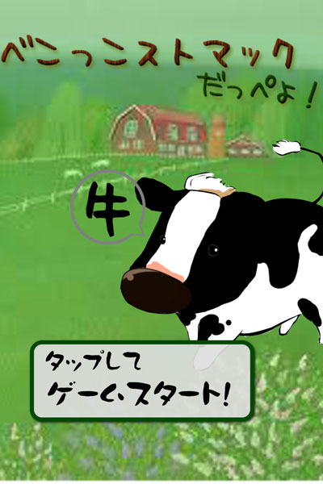

# べこっこストマック だっぺよ！(Cow's Stomachs!)

## Play!

画像をクリックしてね！(Click Below Image to Play!)

## ゲームの概要(description)

べこっこ(ウシ)をおいしく育てて出荷！

ウシ(cow)は胃(stomachs)が4つあるんです！
4つの胃を繰り返し(continute)使って、反芻(はんすう: rumination)します！！
それをゲームにしました！！

1. まず、ウシに、エサを与えます。
2. 次に、エサを消化する胃の順番を選びます。  
  胃には消化特性があり、エサに対して最適な順番があります。  
  4つの胃で消化を繰り返す(continue)ことでウシが育ちます。
3. ウシがやせたり、太りすぎないよう、ほどよくおいしく育てましょう。

# 実績(Diversifier)

1. コラボレーション(Collaboration with everyone)  
  取り入れる予定です。
2. フィードバックの反映(We reflect feedbacks)  
  取り入れる予定です。
3. 会場周辺の情景(Let’s take photos outdoors)  
  取り入れる予定です。
6. タブレット端末への対応(On the tablets)  
  タブレット端末で動作します。
7. パートナーツールの使用(We use the tools of partners)  
  [enchant.js](http://enchantjs.com)を使用
8. 子供たちへメッセージを(Message to children)  
  育てよう！　育とう！　続けよう！

## 対応プラットフォーム(System Requirements)

[enchant.js](http://enchantjs.com)対応プラットフォーム(HTML5対応ブラウザ)

## チーム名(Team Name)
べこっこストマック だっぺよ！

# メンバー(Members)
* 下山樹
* 馬目のりゆき
* 小久保温